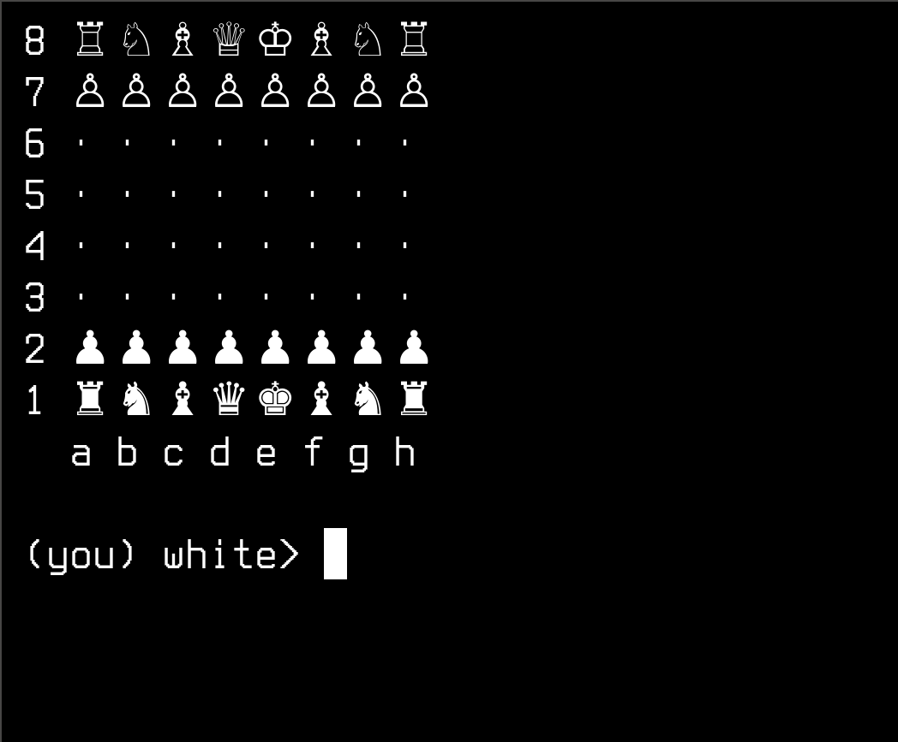

# C4CLI - A simple chess interface for command-line

C4CLI is a bash script to play chess in the command-line.

This use utf8 chars to show the pieces and the board. On tty consoles, 
it use letters to represent the pieces because some console fonts dont support 
utf8 chars.

## Installation

To install, clone the script, save on '.local/bin' for only your user, or '/usr/local/bin' fo all users on system, and make it executable:

```bash
   $ git clone https://github.com/albertguedes/c4cli.git
   $ cd c4cli
   $ sudo cp c4cli.sh ~/.local/bin
   $ sudo chmod +x ~/.local/bin/c4cli.sh
```

Dont forget to put '~/.local/bin' on your path.

## Usage

To execute, type on your terminal:

```bash
   $ c4cli.sh
```

and you will see the game interface



Commands:

- Type something like 'e2e4' to make a move.
- Type 'h' or 'help' to show this help message.
- Type 'q' or 'quit' to quit the game.

And that's it!

## Tests

To run the tests, type:

```bash
   $ tests/test_c4cli.sh
```

and you will see the results.

## License

MIT License <https://opensource.org/licenses/MIT>

## Notes

- This script is compatible at least with bash version 5.2.37 or later.
- There are a simple rules to validate moves, but not all moves are valid, but
  you can adapt the moves validation to your needs, creating the rules or
  using a chess engine like [gnuchess](https://www.gnu.org/software/gnuchess/) or [stockfish](https://stockfishchess.org/).

## References

- [Bash reference manual](https://www.gnu.org/software/bash/manual/bash.html)
- [Chess notation](https://en.wikipedia.org/wiki/Algebraic_notation_(chess))
- [Unicode chess symbols](https://en.wikipedia.org/wiki/Chess_symbols_in_Unicode)
- [Universal Chess Interface](https://www.chessclub.com/help/uci)
